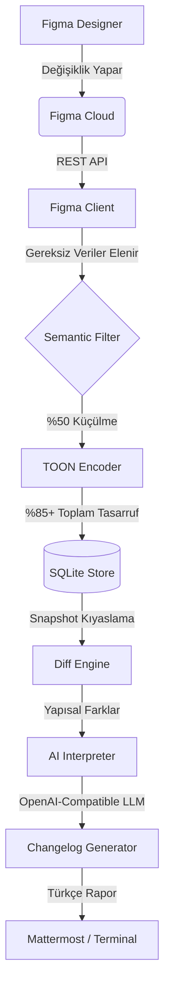

# DesignRadar 🎯 — Figma to AI Changelog

DesignRadar, Figma dosyalarındaki değişiklikleri "sessizce" takip eden, bu değişiklikleri **TOON** formatında sıkıştırarak AI (LLM) ile yorumlayan ve ekiplerinize (Mattermost/Terminal) anlamlı bir changelog olarak sunan bir Micro-SaaS prototipidir.

---

## 🏗️ Çalışma Mantığı (System Architecture)

Sistem, bir tasarımcının Figma'da yaptığı değişikliği saniyeler içinde algılayıp raporlamak için şu boru hattını (pipeline) kullanır:



### 🧠 Bizim "Secret Sauce": TOON ve Semantic Filtering

Figma'nın ham verisi devasadır (tek dosya için 2-5 MB). Bunu doğrudan LLM'e göndermek hem yavaştır hem de çok maliyetlidir. DesignRadar iki aşamalı bir sıkıştırma uygular:

1.  **Semantic Filtering**: Vektör path'leri, prototip linkleri gibi "developer'ı ilgilendirmeyen" veriler elenir. Sadece renk, metin, layout ve hierarchy tutulur. (**%50 tasarruf**)
2.  **TOON (Token-Oriented Object Notation)**: Veri, LLM'lerin en sevdiği ve en az token harcadığı TOON formatına çevrilir. (**Ekstra %40 tasarruf**)

Totalde token maliyetinde **%85-%95** arası bir azalma sağlanır.

---

## ⚙️ Teknik Strateji

| Özellik | Açıklama |
| :--- | :--- |
| **Language** | TypeScript (Node.js 20+) - Tip güvenliği ve hızlı geliştirme. |
| **Storage** | SQLite - Sıfır bağımlılık, on-prem dostu ve hızlı snapshot saklama. |
| **Diffing** | Structural Deep Diff - Sadece görsel ve içeriksel değişiklikleri yakalar. |
| **LLM** | OpenAI tabanlı (GPT-4o / Local Ollama / Github Models) - Esnek model desteği. |
| **Output** | Dual-Mode: Developerlar için terminal, ekipler için Mattermost Webhook. |

---

## 🚀 Kurulum ve Çalıştırma

### 1. Hazırlık
```bash
cd design-radar
npm install
```

### 2. Yapılandırma
`.env.example` dosyasını `.env` olarak kopyalayın ve gerekli bilgileri doldurun:
```bash
cp .env.example .env
```

**Ayarlar:**
- `FIGMA_TOKEN`: Figma Personal Access Token.
- `FIGMA_FILE_KEYS`: İzlemek istediğiniz dosyaların ID'leri.
- `LLM_API_KEY`: OpenAI veya uyumlu bir servis anahtarı.
- `OUTPUT_MODE`: `terminal` (dev) veya `mattermost` (prod).

### 3. Test Senaryosu (Adım Adım)
1.  **Baseline Oluşturun**: `npm run poll-once` komutunu çalıştırın. Bu, tasarımın mevcut halini kaydeder.
2.  **Figma'da Değişiklik Yapın**: Bir butonun rengini değiştirin veya bir metni güncelleyin.
3.  **Rapor Alın**: Tekrar `npm run poll-once` çalıştırın.
    *   Sistem yeni versiyonu algılar.
    *   TOON formatında encode eder.
    *   Eski haliyel karşılaştırır.
    *   AI bunu yorumlar ve size raporlar!

---

## 🧪 Testler
Unit testlerimiz, converter ve diff motorunun hatasız çalıştığını doğrular:
```bash
npm test
```

---

## 📦 Proje Yapısı
- `src/toon-converter.ts`: Figma JSON'u TOON formatına çeviren motor.
- `src/differ.ts`: Değişiklikleri bulan algoritma.
- `src/ai-changelog.ts`: AI prompt ve yorumlama katmanı.
- `src/poller.ts`: Sistemi yöneten orkestra şefi.
